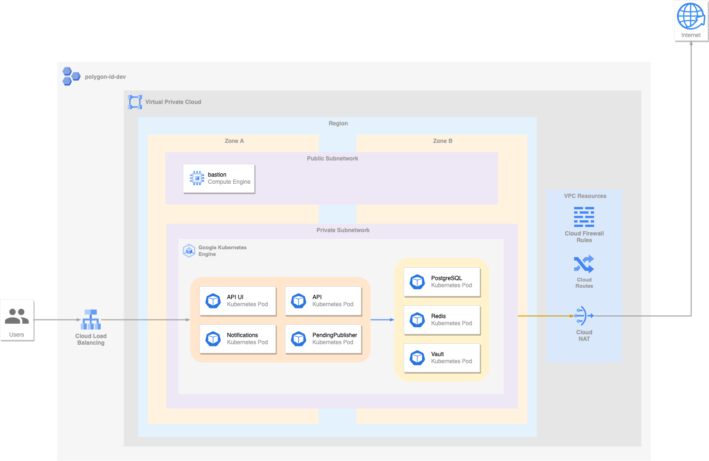

# Overview

Optimism ID issuer refers to the entity responsible for issuing unique identifiers, known as Optimism IDs, on the Optimism network. The Optimism network is a popular Layer 2 scaling solution for Ethereum, designed to improve scalability and reduce transaction costs.

## Architecture



# Installation

## Command line instructions

You can use [Google Cloud Shell](https://cloud.google.com/shell/) or a local
workstation to complete the following steps.


### Prerequisites

#### Set up command-line tools

Make sure you have these tools installed.

- [gcloud](https://cloud.google.com/sdk/gcloud/)
- [kubectl](https://kubernetes.io/docs/reference/kubectl/overview/)
- [docker](https://docs.docker.com/install/)
- [git](https://git-scm.com/book/en/v2/Getting-Started-Installing-Git)
- [helm](https://helm.sh/)

Configure `gcloud` as a Docker credential helper:

```shell
gcloud auth configure-docker
```

#### Create a Google Kubernetes Engine cluster

If you have an existing GKE cluster you can use that otherwise you can create a new cluster from the command line.

```shell
export CLUSTER=YOUR_CLUSTER_NAME
export PROJECT=YOUR_PROJECT_ID
export REGION=YOUR_REGION
export ZONE=YOUR_ZONE

gcloud container clusters create $CLUSTER --region=$REGION --project $PROJECT
```

Configure `kubectl` to connect to the new cluster.

```shell
gcloud container clusters get-credentials $CLUSTER --region=$REGION --project $PROJECT
```

For zonal clusters, use --zone=ZONE instead of --region=REGION.

#### Requests a static ip

```sh
gcloud compute addresses create ip-name --global
gcloud compute addresses describe ip-name --global

# ...
# address: 203.0.113.32
# ...
```

### Configure the app with environment variables

Create ./scripts/secrets.sh

```shell
export APP_INSTANCE_NAME=issuer
export NAMESPACE=default
export MAINNET=false
export RPC_URL="https://opt-sepolia.g.alchemy.com/v2/..."
export UI_USERNAME=user
export UI_PASSWORD=password
export API_UI_USERNAME=user
export API_UI_PASSWORD=password
export API_USERNAME=user    
export API_PASSWORD=password
export STATIC_IP_NAME="opid"
export APP_HOST=app.34.54.152.126.nip.io  
export UI_HOST=ui.34.54.152.126.nip.io    
export API_HOST=api.34.54.152.126.nip.io  
export ISSUER_NAME="OPID Issuer"
export PRIVATE_KEY="5a814bcdce..."
export VAULT_PASSWORD=password
export RHS_MODE=OnChain
export RHS_URL="..."
```

### Install the helm chart

First ensure your kubectl context is pointing to the right project, then run:

```shell
chmod +x ./scripts/install.sh
chmod +x ./scripts/uninstall.sh
chmod +x ./scripts/upgrade.sh

# install
./scripts/install.sh

# uninstall
./scripts/uninstall.sh

# upgrade
./scripts/upgrade.sh
```
